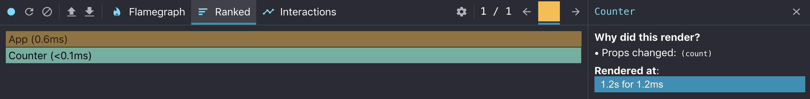
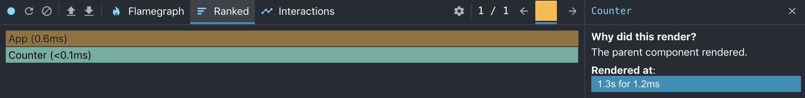
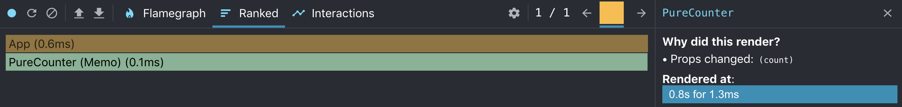
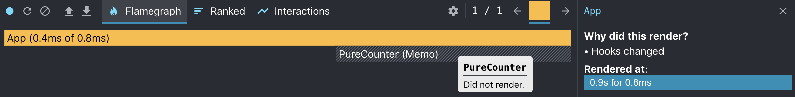

*Optimization is fun because it's not necessary.* - Brad Fitzpatrick

While I don't necessarily agree with this statement in a strict sense, I do understand the point that Fitzpatrick is trying to make. Over optimization is a trap that the programmer needs to 
constantly be on the lookout for, but that doesn't mean that we shouldn't make informed decisions upfront about architecture, standards, and strategies to make our apps as performant as possible. 
Putting in a timeboxed spike upfront can be an effective way to avoid pitfalls and "gotchas" when approaching a new feature or project, as it allows us to get a lay of the land and and forces 
us to look at exactly what we're trying to accomplish. This way we establish a scope and then we can always iterate and optimize as we get further into development.

When it comes to React, there
aren't many things we need to worry about upfront, in terms of performance. The use of the virtual DOM means that even the most inefficient React app still tends to be relatively performant. But the
one area where React doesn't take any chances is the component render lifecycle. Our friends at Facebook want to make sure that our UIs are always up to date, even if it means that we waste render cycles
that are redundant or unnecessary. Luckily, React gives us several ways to help prune down unnecessary calls to a component's `render` method. Typically, this is done using the `shouldComponentUpdate` method,
but if we know that we never want to re-render a component unless the props or state changes then we can use [Pure Components](https://reactjs.org/docs/react-api.html#reactpurecomponent).

## A Little Bit of Context
Before getting started, let's understand what happens when our components get updated. The component lifecycle has two phases: **render** and **commit**. The render phase is when the `render` method on the 
component is called and the output is compared with the last copy on the virtual DOM (this process is called [Reconciliation](https://reactjs.org/docs/reconciliation.html)). The commit phase is when React updates the DOM with the determined changes and then invokes the lifecycle handler,
like `componentDidUpdate`. If we look at the React docs, we see that this render cycle gets kicked off anytime one of the following happens:

1. “state” values are updated
2. “props” values are updated
3. `this.forceUpdate()` is called

Now, there is an additional case that is often overlooked. When React decides that a component needs to be updated, that means that it plans to re-render **the entire subtree of that component**. This
means that all the child components will be re-rendered, along with the parent. So, let's update our list to make this clear:

1. “state” values are updated
2. “props” values are updated
3. `this.forceUpdate()` is called
4. **any of the above happen in a parent component**

To be as explicit as possible, let's walk through exactly what happens when one of these cases is true.


As shown in the diagram, we can use `shouldComponentUpdate` (or the equivalent when using Hooks in functional components) to bypass the render lifecycle altogether. This means that we avoid all the overhead
of the diffing algorithm used during the reconciliation. It is a smarter and more efficient way for us to directly tell React "no need to bother figuring out if this component needs re-rendered - it doesn't."
But the React developers figured out that in many cases, we never want to re-render our component if the props haven't changed - the output is always driven entirely by the inputs, hence the name "pure" components. We could write `shouldComponentUpdate` methods that compare all the props
for each of our components, but that sounds like a lot of work. If only there was a standard way to encapsulate that behavior for all of our simpler components...

## Pure Components

`PureComponent`s do not re-render when the props and/or state have been updated with the same values. They provide the same interface as a standard `Component`, except that the `shouldComponentUpdate` method
is implemented for us with a shallow comparison of the state and props. Note that this is a shallow comparison, meaning that non-primitives will be compared by reference. There are ways to handle this that
may be covered in a future post. A `PureComponent` can be implemented as follows:

```javascript
import React, { PureComponent } from "react";

class Pure extends PureComponent {
  render() {
    return (
      <div />
    );
  }
}

export default Pure;
```

Simple enough. But what about functional components? Not to fear, React gives us an HOC called [`memo`](https://reactjs.org/docs/react-api.html#reactmemo) that we can use to make our functional components pure using memoization.
A pure functional component might look something like:

```javascript
import React, { memo } from "react";

const Pure = () => {
  return (
    <div />
  );
};

export default memo(Pure);
``` 

Let's look at some concrete examples to tie this off. Suppose we have an app with a simple `Counter` component that takes a prop `count` and displays the count in a `<p>` tag. A bit contrived, but it'll do.
Now, let's say that the `count` prop is driven by the state of a parent `App` component, and the count is incremented each time we press a button.

Our `App` would look like:

```javascript
import React, { useState } from "react";
import "./App.css";

import Counter from "./Counter";

function App() {
  const [count, setCount] = useState(0);
  return (
    <div className="App">
      <Counter count={count} />
      <button onClick={() => setCount(count + 1)}>Increment</button>
    </div>
  );
}

export default App;
```

And our `Counter` would look like:
```javascript
import React from "react";

const Counter = ({ count }) => {
  return (
    <p>{count}</p>
  );
};

export default Counter;
```

We can use the Profiler React Dev Tool to analyze the render lifecycle when we increment the count.



We can see that the `Counter` is re-rendered because the props changed. Nothing to see here. Even if we were using pure components, we would see the same behavior because the component obviously needs to
re-render.

Now, let's update our component so that, even when the parent's state changes, it's props do not. We can accomplish this by simply setting the `count` prop being passed in to always be `0`.

```javascript
import React, { useState } from "react";
import "./App.css";

import Counter from "./Counter";

function App() {
  const [count, setCount] = useState(0);
  return (
    <div className="App">
      <Counter count={0} />
      <button onClick={() => setCount(count + 1)}>Increment</button>
    </div>
  );
}

export default App;
```

In this new contrived example, we never need our `Counter` component to re-render, even when the parent's state changes and a re-render is triggered for the parent. But when we look at the Profiler in this
case, we see something unexpected.



It looks like the child `Counter` component re-rendered even though we didn't need it to. Again, this is because the entire component subtree is re-rendered by default anytime an update is triggered for 
a component. But we can solve this with pure components.

Now, let's say we have a `PureCounter` component that uses React Memo. 

```javascript
import React, { memo } from "react";

const PureCounter = ({ count }) => {
  return (
    <p>{count}</p>
  );
};

export default memo(PureCounter);
```

And we implement that component in the main `App`.

```javascript
import React, { useState } from "react";
import "./App.css";

import PureCounter from "./PureCounter";

function App() {
  const [count, setCount] = useState(0);
  return (
    <div className="App">
      <PureCounter count={count} />
      <button onClick={() => setCount(count + 1)}>Increment</button>
    </div>
  );
}

export default App;
```

If we look at the standard example using `PureCounter` in the Profiler, it looks exactly the same as the normal `Counter`. This is because in both cases the components actually need re-rendered when the count changes.



But now let's look what happens when we set the `count` prop to always be `0` like we did for the second example with the normal `Counter`.

```javascript
import React, { useState } from "react";
import "./App.css";

import PureCounter from "./PureCounter";

function App() {
  const [count, setCount] = useState(0);
  return (
    <div className="App">
      <PureCounter count={0} />
      <button onClick={() => setCount(count + 1)}>Increment</button>
    </div>
  );
}

export default App;
```

And when we look at the Profiler.



Look at that! Our `PureCounter` component didn't re-render, like we wanted. This, again, is because `memo` is automatically determining that the component does not need to be re-rendered due to the
fact that the `count` prop didn't change. 

You can imagine how many redundant renders are being done in your component tree if you're not handling these cases. The larger the components, the more apparent it will be. So, do yourself a favor and just
use `PureComponent` or `memo` for your components that could be pure.

## Some Caveats

As always, the usage depends on the case. Before using a pure component, make sure to ask yourself the following questions:
* Does my component have any non-primitive props? If so, you will need to extend the comparison function to do a deep comparison or begin using immutable objects.
* Does the presentation of my component depend entirely on state and/or props? Pure components assume that the component doesn't need re-rendered if those don't change, but maybe that isn't the case.
* Does my component have any children that **may** need updated, even if my component doesn't? Remember how React re-renders the entire subtree of the component? Well, that also means that if the
component doesn't re-render than none of the children do either. 

If the answer to any of these questions is "yes" then you may need to reconsider using pure components in this case. If not, you should be free to proceed and take back those extra render cycles. Enjoy.