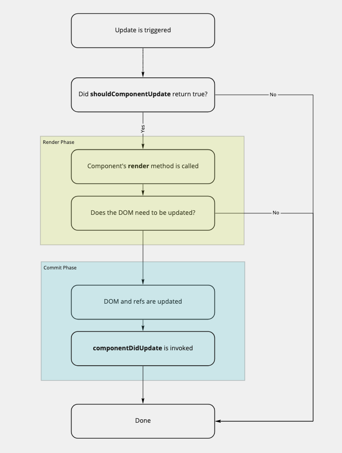

*Optimization is fun because it's not necessary.* - Brad Fitzpatrick

While I don't necessarily agree with this statement in a strict sense, I do understand the point that Fitzpatrick is trying to make. Over optimization is a trap that the programmer needs to 
constantly be on the lookout for, but that doesn't mean that we shouldn't make informed decisions upfront about architecture, standards, and strategies to make our apps as performant as possible. 
Putting in a timeboxed spike upfront can be an effective way to avoid pitfalls and "gotchas" when approaching a new feature or project, as it allows us to get a lay of the land and and forces 
us to look at exactly what we're trying to accomplish. This way we establish a scope and then we can always iterate and optimize as we get further into development. When it comes to React, there
aren't many things we need to worry about upfront, in terms of performance. The use of the virtual DOM means that even the most inefficient React app still tends to be relatively performant. But the
one area where React doesn't take any chances is the component render lifecycle. Our friends at Facebook want to make sure that our UIs are always up to date, even if it means that we waste render cycles
that are redundant or unnecessary. Luckily, React gives us several ways to help prune down unnecessary calls to a component's `render` method. Typically, this is done using the `shouldComponentUpdate` method,
but if we know that we never want to re-render a component unless the props change then we can use [Pure Components](https://reactjs.org/docs/react-api.html#reactpurecomponent).

## A Little Bit of Context
Before getting started, let's understand what happens when our components get updated. The component lifecycle has two phases: **render** and **commit**. Render is when the `render` method on the 
component is called and the output is compared with the last copy on the virtual DOM (this process is called [Reconciliation](https://reactjs.org/docs/reconciliation.html)). The commit phase is when React updates the DOM with the determined changes and then invokes the lifecycle handler,
like `componentDidUpdate`. If we look at the React docs, we see that this process gets kicked off anytime one of the following happens:

1. “setState” is called in Component
2. “props” values are updated
3. `this.forceUpdate()` is called

Now, there is an additional case that is often overlooked. When React decides that a component needs to be updated, that means that is plans to re-render **the entire subtree of that component**. This
means that all the child components will be re-rendered as well, along with the parent. So, our updated list looks like this:

1. “setState” is called in Component
2. “props” values are updated
3. `this.forceUpdate()` is called
4. **any of the above happen in a parent component**

